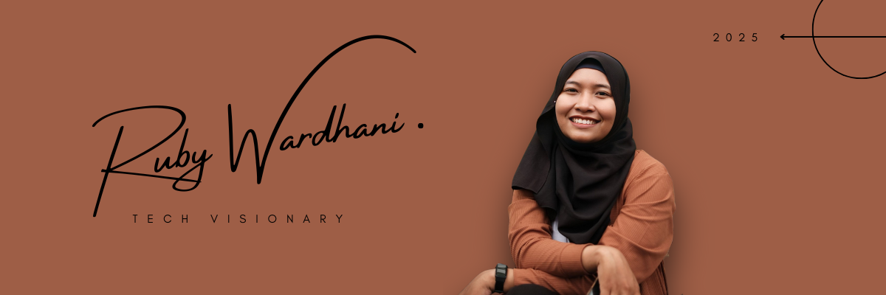

<h1 align="center">Hi, I'm Ruby Wardhani 👋</h1>

<i>Exploring AI & Technology for Business Innovation</i>

  💼 IT Officer at Dako | 🚀 Founder at Pionedge | 🤖 Exploring AI Applications for Business

  
  
  
  

---

---

### 🧠 About Me

I’m an Information Technology professional currently working as an **IT Officer at Dako**, while also building **Pionedge**, an IT service and consulting initiative focused on helping businesses leverage technology to solve real-world problems.

With a background in Informatics, my experience spans **software development, data analysis, and technology project management**. I’m particularly interested in how emerging technologies—especially **Artificial Intelligence**—can improve business processes, decision-making, and operational efficiency.

Alongside my professional work, I continuously explore new technologies and experiment with projects that bridge **technology innovation and real-world business applications**.

My long-term goal is to build impactful technology-driven products and companies while deepening my expertise in **AI and intelligent systems**.

---

### 🧰 Tech Stack & Tools

---

### 🔬 Selected Projects & Research

📖 **[The Fabrique: A Pathfinding Algorithm in a Mobile Game Developed Using Construct 3](https://www.pubs.ascee.org/index.php/iota/article/view/915)**  
*Published in IOT and AI Technology Conference (IOTA)*  
Designed a pathfinding algorithm for NPC navigation in a 2D mobile game built using Construct 3.

🚧 **AI & Technology Experiments (Ongoing)**  
Currently exploring different approaches to applying AI and machine learning to real-world business problems, automation, and data-driven decision making.

🔗 More publications on [Google Scholar](https://scholar.google.com/citations?user=Qlr23mwAAAAJ&hl=en)

---

### 🔍 Areas of Interest

- 🤖 Artificial Intelligence  
- 📊 Data & Business Intelligence  
- 🧠 Machine Learning  
- ⚙️ Automation & Intelligent Systems  
- 🚀 Technology for Business Innovation  

---

### 📈 GitHub Stats

  

---

### 🤝 Open for Collaboration

I’m open to collaborations on **technology projects, AI experiments, and applied digital solutions**, especially those focused on solving real-world problems for businesses and organizations.

Feel free to connect on [LinkedIn](https://www.linkedin.com/in/ruby-wardhani/) or explore my research on [ORCID](https://orcid.org/0009-0005-2227-6715).

---

<i>"Building technology that turns ideas into real-world impact."</i>
